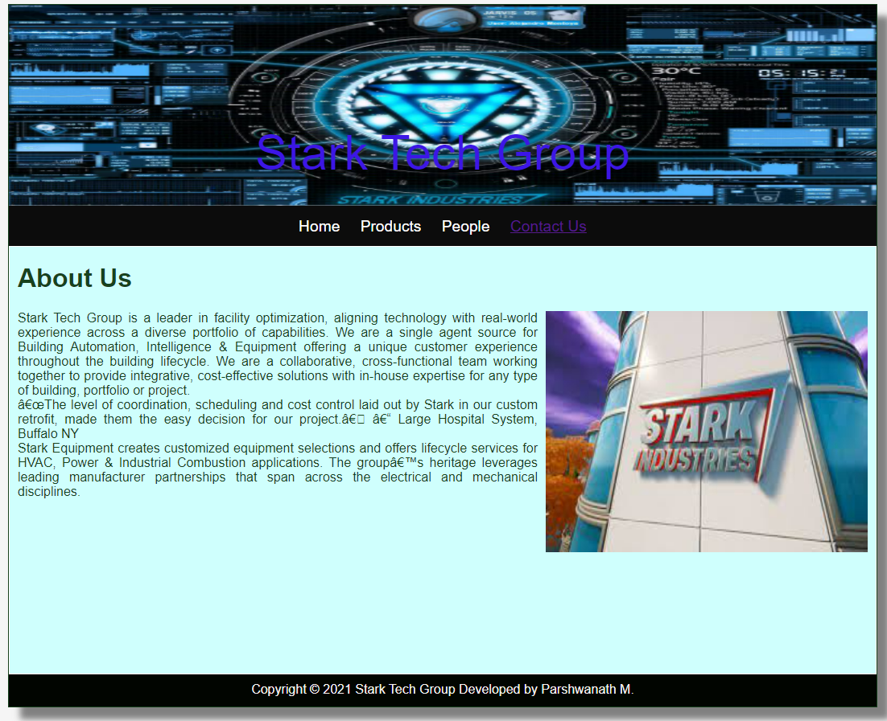
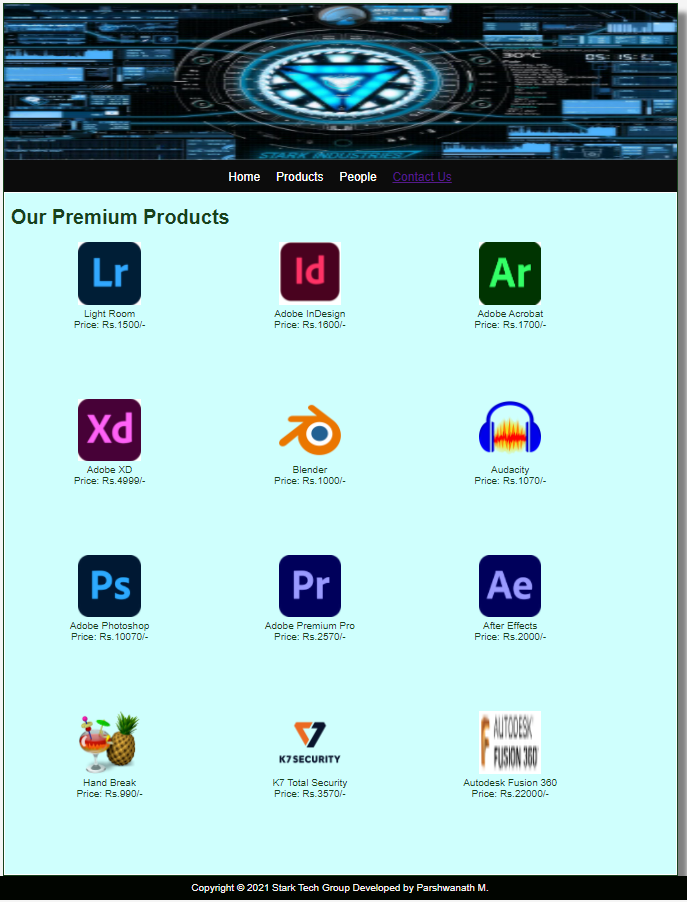
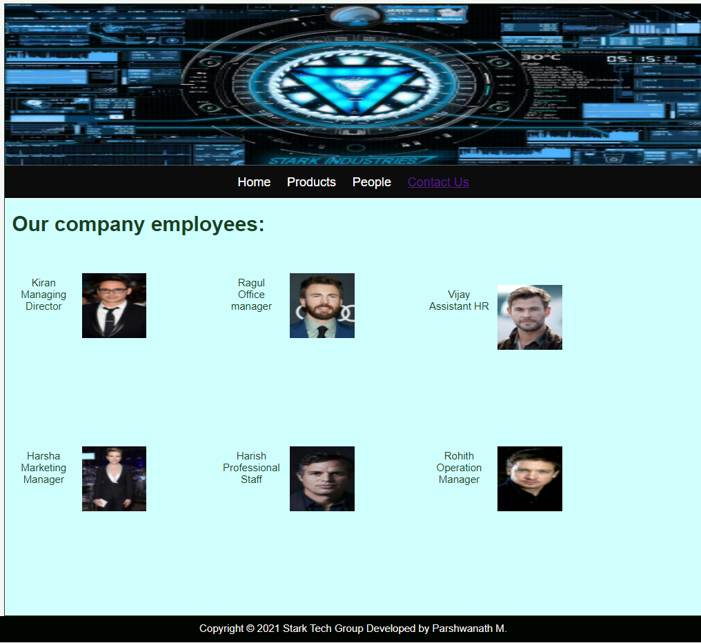
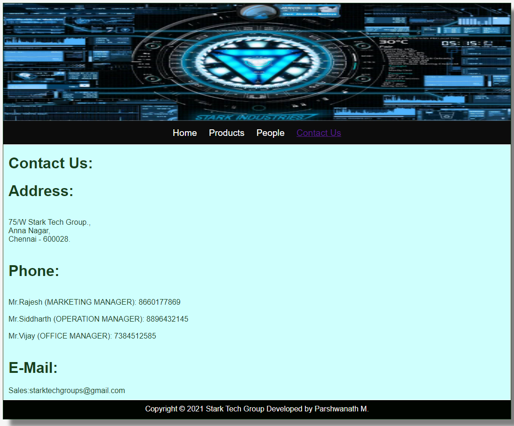

# Web Design for a Software Product Company

## AIM:

To design a static website for a software product company company.

## DESIGN STEPS:

### Step 1:

Requirement collection.

### Step 2:

Creating the layout using HTML and CSS.

### Step 3:

Updating the sample content.

### Step 4:

Choose the appropriate style and color scheme.

### Step 5:

Validate the layout in various browsers.

### Step 6:

Validate the HTML code.

### Step 6:

Publish the website in the given URL.

## PROGRAM :

### Home Page:
~~~
<!DOCTYPE html>
<html lang="en">
  <head>
    <title>Stark Tech Group</title>
    <link rel="stylesheet" href="./css/layout.css" />
    <link rel="icon" href="./img/icon.png" type="image/x-icon" />
  </head>

  <body>
    

      
Stark Tech Group

      

        
<a href="/static/home.html">Home</a>

        
<a href="/static/products.html">Products</a>

        
<a href="/static/people.html">People</a>

        
<a href="/static/contactus.html">Contact Us</a>

        

      

        

          <h1>About Us</h1>
          
          

            Stark Tech Group is a leader in facility optimization, aligning technology with real-world experience across a diverse portfolio of capabilities. We are a single agent source for Building Automation, Intelligence & Equipment offering a unique customer experience throughout the building lifecycle. We are a collaborative, cross-functional team working together to provide integrative, cost-effective solutions with in-house expertise for any type of building, portfolio or project.
             
            
“The level of coordination, scheduling and cost control laid out by Stark in our custom retrofit, made them the easy decision for our project.”
– Large Hospital System, Buffalo NY
 
Stark Equipment creates customized equipment selections and offers lifecycle services for HVAC, Power & Industrial Combustion applications. The group’s heritage leverages leading manufacturer partnerships that span across the electrical and mechanical disciplines. 

   
          

        

      

      

        Copyright &#169; 2021 Stark Tech Group Developed by Parshwanath M.
      

    

  </body>
</html>
~~~
### Product:
~~~
<!DOCTYPE html>
<html lang="en">
  <head>
    <title>Stark Tech Group</title>
    <link rel="stylesheet" href="./css/layout.css" />
    <link rel="icon" href="./img/icon.png" type="image/x-icon" />
  </head>

  <body>
    

      

      

        
<a href="/static/home.html">Home</a>

        
<a href="/static/products.html">Products</a>

        
<a href="/static/people.html">People</a>

        
<a href="/static/contactus.html">Contact Us</a>

        

      

        
    
          <h1>Our Premium Products</h1>
          

              
 
                  

                  
                  

                  
Light Room

                  
Price: Rs.1500/- 

              

              
 
                  

                  
                  

                  
Adobe InDesign

                  
Price: Rs.1600/- 

              

              
 
                

                
                

                
Adobe Acrobat

                
Price: Rs.1700/- 

              

              
 
                

                
                

                
Adobe XD

                
Price: Rs.4999/- 

            

            
 
              

              
              

              
Blender

              
Price: Rs.1000/- 

          
  
 
            

            
            

            
Audacity

            
Price: Rs.1070/- 

          
  
 
            

            
            

            
Adobe Photoshop

            
Price: Rs.10070/- 

          
  
 
            

            
            

            
Adobe Premium Pro

            
Price: Rs.2570/- 

          
  
 
            

            
            

            
After Effects

            
Price: Rs.2000/- 

        

      
  
 
        

        
        

        
Hand Break

        
Price: Rs.990/- 

      
  
 
        

        
        

        
K7 Total Security

        
Price: Rs.3570/- 

      
  
 
        

        
        

        
Autodesk Fusion 360

        
Price: Rs.22000/- 

    

            

          

          
        
      

      

        Copyright &#169; 2021 Stark Tech Group Developed by Parshwanath M.
      

    

  </body>
</html>
~~~
### People:
~~~
<!DOCTYPE html>
<html lang="en">
  <head>
    <title>Stark Tech Group</title>
    <link rel="stylesheet" href="./css/layout.css" />
    <link rel="icon" href="./img/ail.png" type="image/x-icon" />
    </head>
    <body>
    

      

      

        
<a href="/static/home.html">Home</a>

        
<a href="/static/products.html">Products</a>

        
<a href="/static/people.html">People</a>

        
<a href="/static/contactus.html">Contact Us</a>

        

      

        

          <h1>Our company employees:</h1>  
          

            
 
                

                
                

                
Kiran

                
Managing Director

            

            
 
                

                
                

                
Ragul

                
Office manager

            

            
 
              

              
              

              
Vijay

              
Assistant HR

            

            
 
              

              
              

              
Harsha

              
Marketing Manager

          

          
 
            

            
            

            
Harish

            
Professional Staff

        
  
 
          

          
          

          
Rohith

          
Operation Manager

      

          

        

        
        
    

    

      Copyright &#169; 2021 Stark Tech Group Developed by Parshwanath M.
    

  

</body>
</html>
~~~
### Contact Us:
~~~
<!DOCTYPE html>
<html lang="en">
  <head>
    <title>Stark Tech Group</title>
    <link rel="stylesheet" href="./css/layout.css" />
    <link rel="icon" href="./img/ail.png" type="image/x-icon" />
  </head>

  <body>
    

      

      

        
<a href="/static/home.html">Home</a>

        
<a href="/static/products.html">Products</a>

        
<a href="/static/people.html">People</a>

        
<a href="/static/contactus.html">Contact Us</a>

      

      

        

          <h1>Contact Us:</h1>
          <h1>Address:</h1> 
          

            75/W Stark Tech Group., 
            Anna Nagar, 
            Chennai - 600028.
          
 
          <h1>Phone:</h1> 
          

              Mr.Rajesh  (MARKETING MANAGER): 8660177869  
              Mr.Siddharth (OPERATION MANAGER): 8896432145  
              Mr.Vijay (OFFICE MANAGER): 7384512585  
          

          <h1>E-Mail:</h1>
          

              Sales:starktechgroups@gmail.com
          

        

      

      

        Copyright &#169; 2021 Stark Tech Group Developed by Parshwanath M.
      

    

  </body>
</html>
~~~

## OUTPUT:

### Home Page:

### Products:

### People:

### Contact Us:

## Result:

Thus a website is designed for the software product company and the HTML,CSS code are validated.
